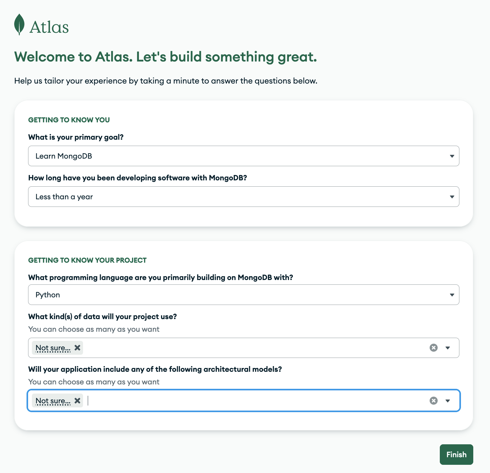
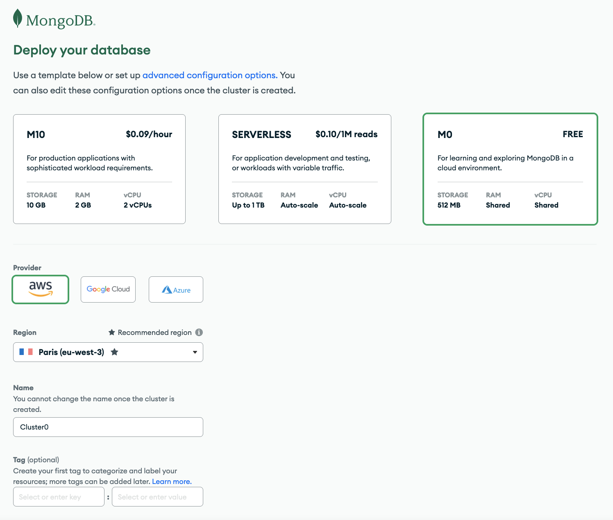
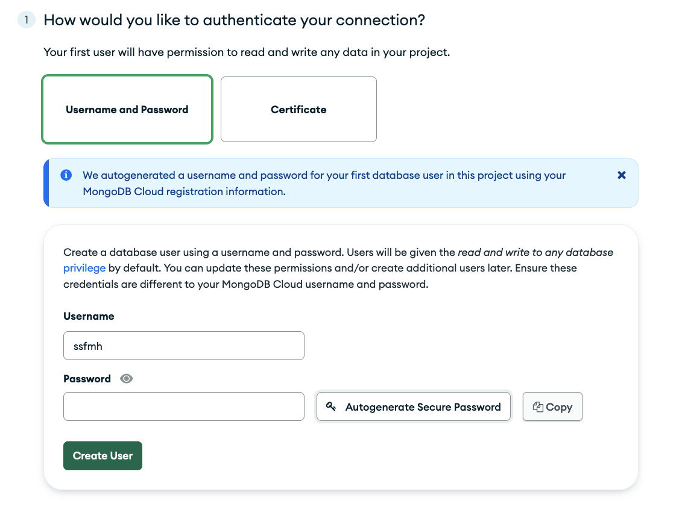
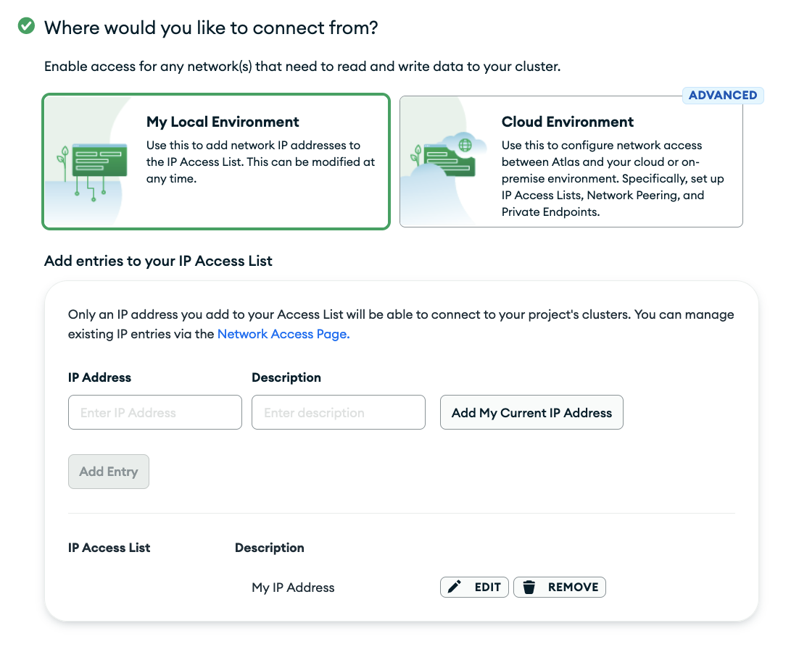

# Créer un cluster sur MongoDB.com


## Créer un compte [MongoDB.com](https://www.mongodb.com/fr-fr)

## Ensuite, après la vérification d'email : 

### Premier formulaire (préférences utilisateur)

**(pas très important, mais augmente les chances d'à avoir les mêmes interfaces pendant le cours)**



### Second formulaire (création du cluster)

#### Choisir : 

- Deploy your database: **M0 Free**
- Provider : **AWS**
- Region : **Paris (EU West)**
- Name : **Cluster0**





### Troisième formulaire (sécurité)

#### Choisir : 

- Authentification avec username et password **Penser à sauvegarder le mot de passe**
    - Créer un fichier `.env` à la racine de votre dossier avec le contenu des variables `user` et `password` : 
    ```
    MONGO_DB_USER=<user>
    MONGO_DB_PASSWORD=<pass>
    ```




- Se connecter depuis sa machine : ajouter son IP à la whitelist




