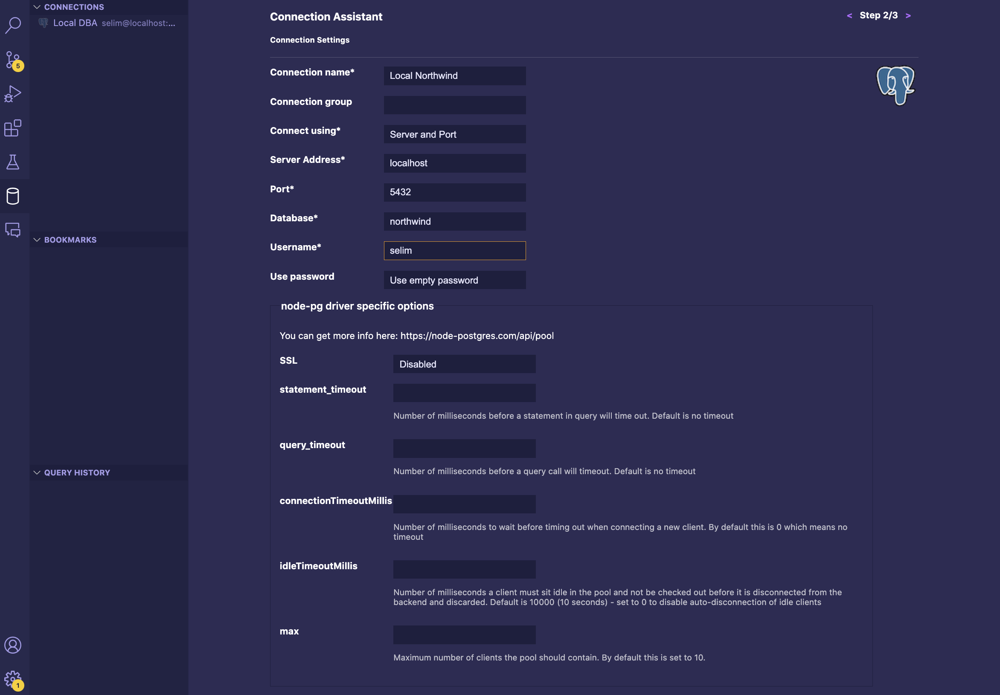

# Setup SQL viewer via VS Code

## Se rendre sur VS Code et cliquer sur l'icône BDD dans la barre latéral

## Choisir PostgreSQL (étape 1)

## Compléter le formulaire (étape 2)

## Tester et enregistrer la connexion (étape 2)

## Se connecter (étape 3)

